# Market

<h3> Market Uygulaması   (Bitti) </h3>

<h3> Market panelden kendine ait alt şubeler oluşturabilir ve her şubeye ait ürün, kategori, alt kategori ve marka oluşturabilir. Sipariş alabilir ve takip edebilir. Sipariş Takip Sistemi vardır. Kasiyerler içinde otomasyon vardır. Burada sadece android uygulaması ve android yönetim uygulamasını tanıtacağım.   </h3>

<h4> Android Müşteri Uygulaması </h3>

### Anasayfa 
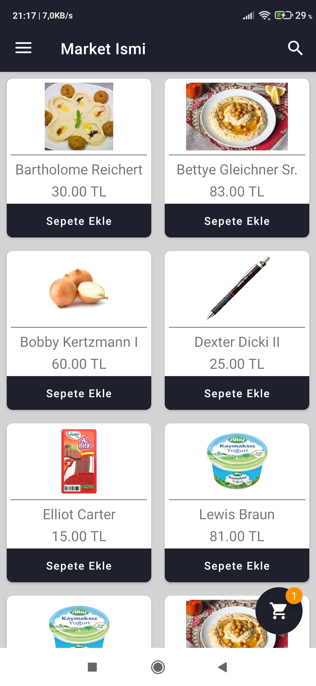

### Menu 
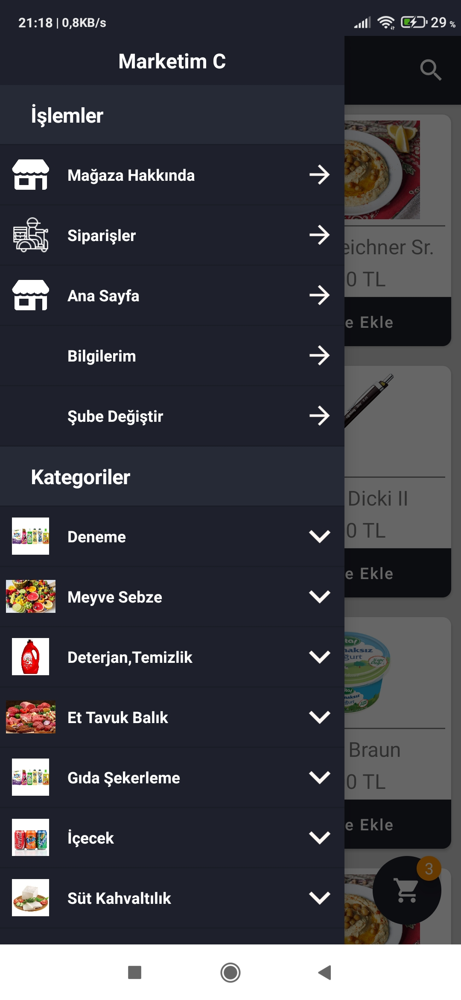

### Sepet 
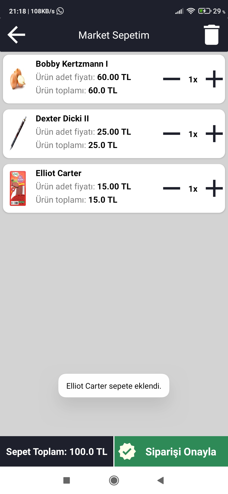

### Sepetin Sipariş Verilmesi 
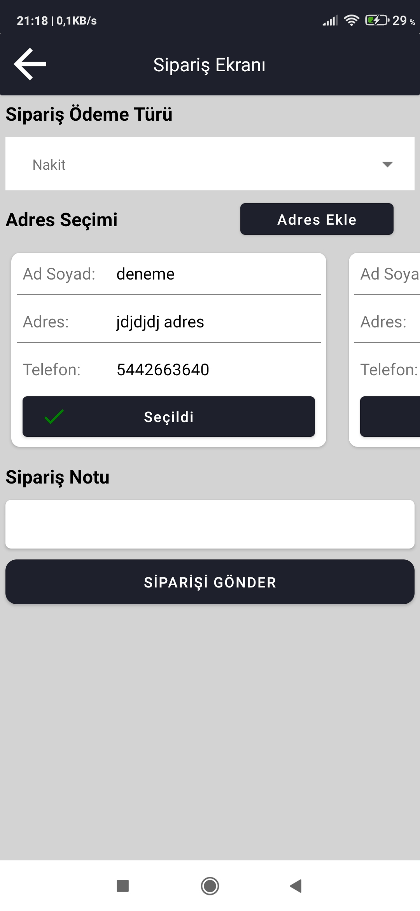

### Siparişlerim 
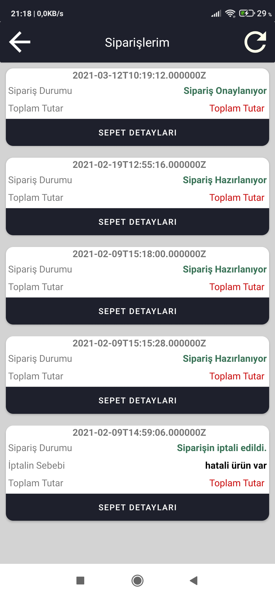

### Sipariş Detay 
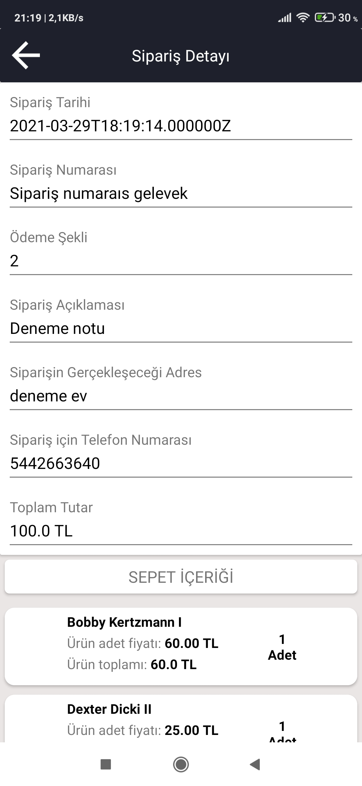

<h3> Market sahini oluşturduğu şubelere ait tüm bilgileri takip edebilir. Örneğin sipariş, stok vb.   </h3>

<h4> Android Yönetim Uygulaması </h3>

### Menu
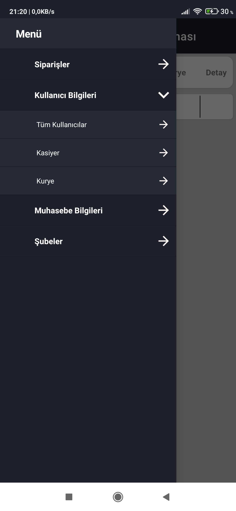

### Kullanıcıların Listelenmesi
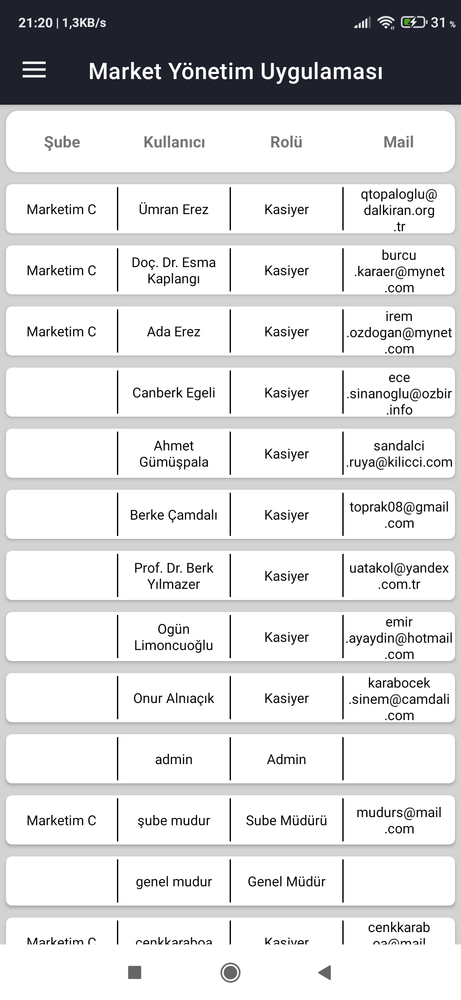

### Kasiyerlerin Listelenmesi
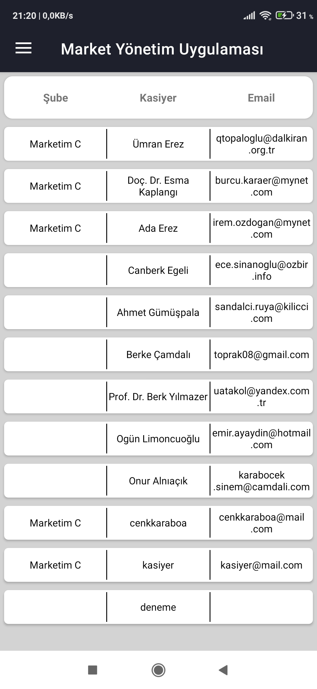

### Seçili Şube Menusu
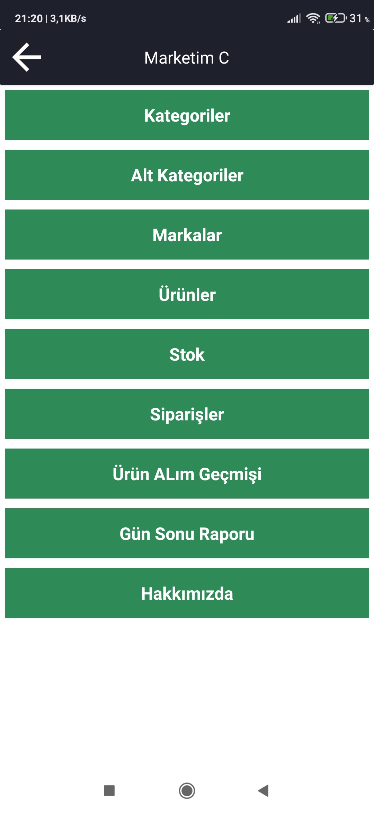

### Şubeye Ait Markalar
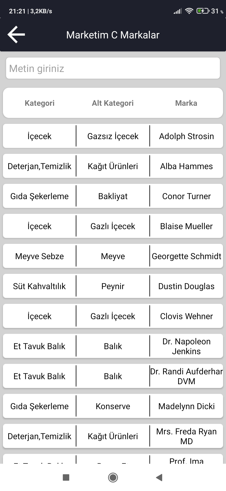

### Şubeye Ait Stok Durumu
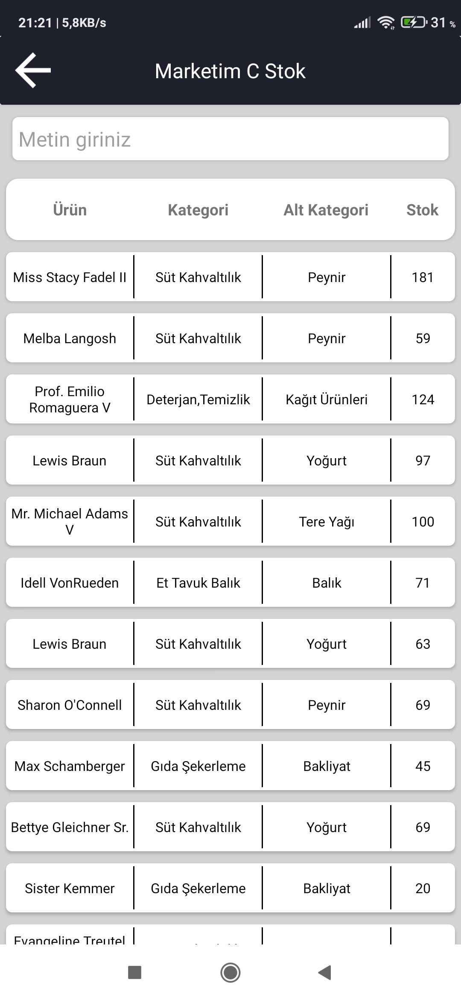

